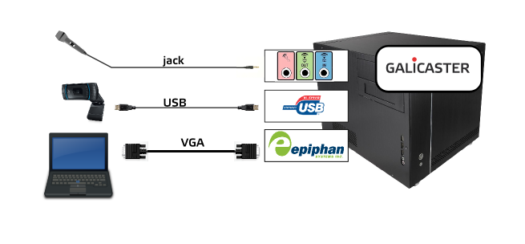
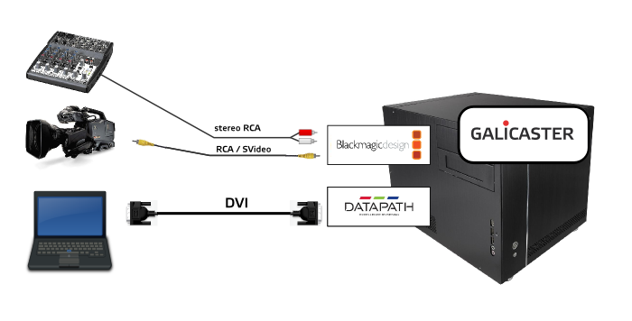
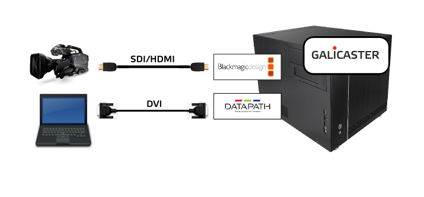

Hardware recommendations
========================

*This document is updated to the 1.4.0 release*

Base unit
---------

Galicaster units are assembled with standard computer components and compatible capture devices and cards. For a good experience with Galicaster, we recommend a series of reference units, all of them sharing the common components indicated in this base unit.

Three different references are proposed: an entry level unit (using a HD webcam), a SD based unit and a HD based unit. Other combinations are possible that may fit your needs better. For instructions on how to assemble or purchase a unit, contact us through our multiple communication channels

CPU and RAM requirements
------------------------

The capture devices used with Galicaster demand a high bandwith capacity and disk writing rate, so a powerful CPU is needed. Depending on the chosen hardware, the following statements will suffice:

* An Intel i3 cpu, minimum.
* 64 bits architecture.
* 4 GB of RAM memory.

The selected hardware must be compatible with your Linux distribution of choice. Our recommendation is using Ubuntu 12.04, since Galicaster is developed and extensively tested in this distribution. Nonetheless, other distributions may work with Galicaster, however some additional testing is advisable.

Touchscreen
-----------

Galicaster's Graphical Interface is designed in an user-friendly, easy-to-use, big-sized style, making it suitable for tactile devices, specially high resolution touchscreens. However, there is nothing against using it with a classic mouse and keyboard interface.

-------------------------------------------------------------------------------------

Reference units
---------------

This section provides some examples of reference units, so that the interested readers can have a reference to begin with. Several combinations can be implemented, even multiple ones on the same unit. Some parameters should be taken into account when making the decision, such as:

    * Pre-existing equipment: cameras, microphones, computers.
    * Recording scenario: lectures, conferences, studio, video-conference.
    * Complementary Hardware: scalers, splitters, audio mixers ...
    * Cost.
    * Publication channels.

-----------------------------------------------------------------------------------------

Entry level unit - HD webcam based
----------------------------------

| Component 	     | Device                      |	Format         | Observations |
|------------------|-----------------------------|-----------------|--------------|
| Base unit        | Intel i3 processor 4 GB RAM |                 |              |
| Camera           | [Logitech c920]             | 720p or 1080p   |              |
| VGA capture card | [Epiphan VGA2USB]           | up to 1280x1024 |	This device is not able to record full motion presentations, only slides |

SD camera and DVI framegrabber
------------------------------

| Component 	     | Device                      |	Format         | Observations |
|------------------|-----------------------------|-----------------|--------------|
| Base unit        | Intel i3 processor 4 GB RAM |                 |              |
|Video capture card| [Osprey 230] Generic Firewire card | PAL/NTSC  DV| Accepts audio via stereo RCA. Accepts embedded audio |
| DVI capture card | [Datapath VisionRBG 1es] | 24bit 1920x1080 x 32bit at 60Hz |	Accepts DVI single link and VGA |

HD configuration unit
---------------------

| Component 	     | Device                      |	Format         | Observations |
|------------------|-----------------------------|-----------------|--------------|
| Base unit        | Intel i7 processor 4GB RAM  |                 |              |
|Video capture card| [Blackmagic Decklink SDI] [Blackmagic Intensity Pro] | 720p, 1080p, 1080i  | Sound embedded or analog |
| DVI capture card | [Datapath VisionRBG 1es]    | 24bit 1920x1080 x 32bit at 60Hz |  | |

*NOTE: Audio can be captured from outside the video capture cards. Multiple audio sources can be recorded at once, but additional processing may be needed afterwards for a proper playback.*
